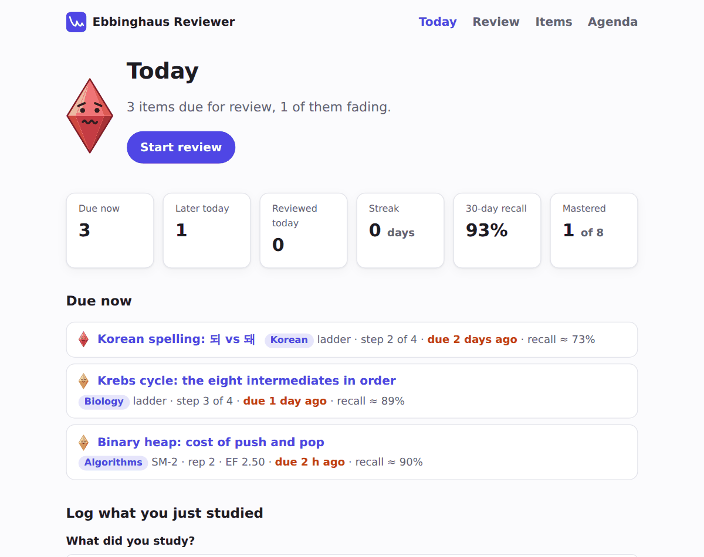
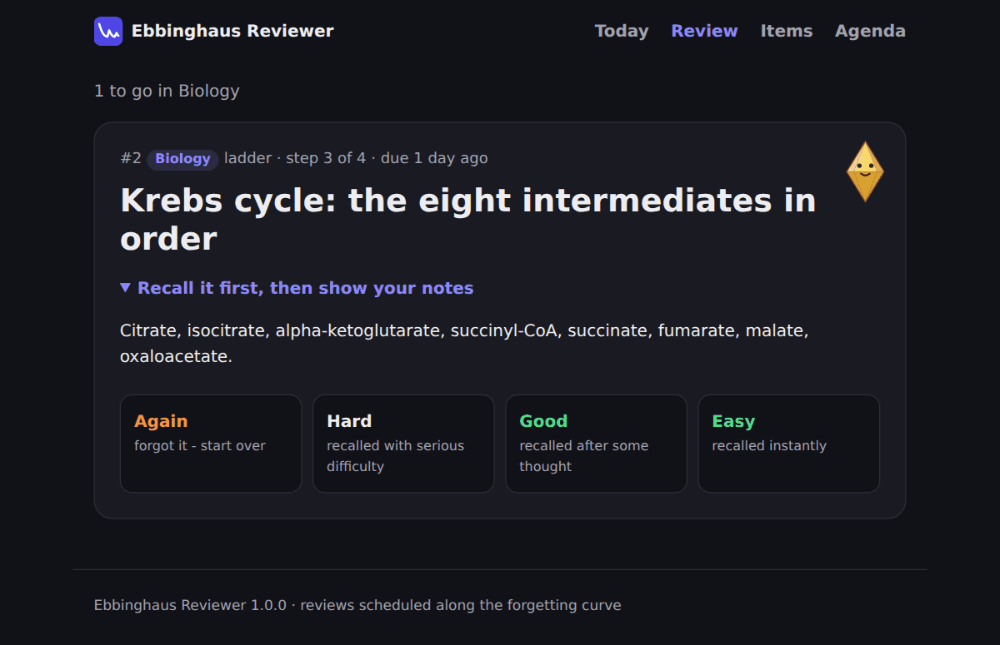
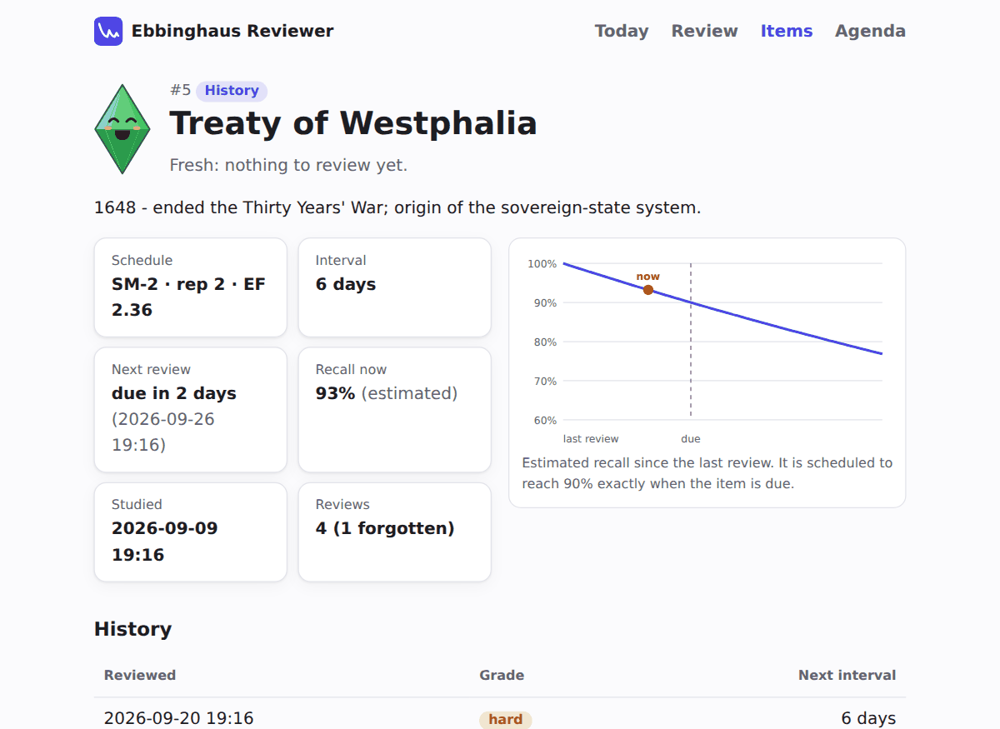

<div align="center">

🇺🇸 [English](README.md) | 🇨🇳 **简体中文** | 🇭🇰 [繁體中文](README.zh-HK.md) | 🇯🇵 [日本語](README.ja.md) | 🇰🇷 [한국어](README.ko.md)


# Ebbinghaus Reviewer

**沿着遗忘曲线复习所学内容：间隔重复命令行工具与本地 Web 应用。**

[](https://github.com/jumincho/ebbinghaus-reviewer/actions/workflows/ci.yml)


[](LICENSE)




</div>

## 概述

学完一样东西，就立刻把它记下来。Ebbinghaus Reviewer 会在你快要忘记时把它重新拿出来让你复习：先是 **10 分钟**后，然后是 **1 天**、**1 周**和 **1 个月**后。它还会每天告诉你哪些内容到期了。每次复习时，从“重来”（*again*）、“困难”（*hard*）、“良好”（*good*）和“简单”（*easy*）中选一个评分，复习安排就会随之调整。每个条目都带有一个《模拟人生》（The Sims）风格的 **Plumbob**（头顶上的菱形水晶），一眼就能看出它的状态：记忆还新鲜时是绿色，到期后变成黄色，快要忘记时变成红色。

## 功能特性

- **两种调度策略。** 每个条目都可以选用固定的 *Ebbinghaus 阶梯*（10 分钟 → 1 天 → 1 周 → 1 个月，之后即为已掌握）或自适应的 *SM-2*。
- **每个条目都有 Plumbob。** 就像《模拟人生》里小人的心情一样，条目的 Plumbob 也会变换颜色和表情：记忆新鲜时是开心的绿色，到期后变成黄色，逾期太久、快要忘记时变成担忧的红色。今日页面和 `stats` 会显示整个集合的 Plumbob。
- **终端工作流。** 提供 `add`、`due`、交互式的 `review`、`agenda`、`stats`、`show`、`edit`、`restart` 等命令，并以易读的表格展示结果。
- **本地 Web 应用。** 包括仪表盘、在你尝试回忆之前隐藏笔记的复习界面、带复习历史和遗忘曲线图的条目页面，以及日程页面。无需 JavaScript 即可使用，也支持深色模式。
- **复习日志。** 每次复习都会连同评分一起记录，并注明是提前还是逾期完成；连续复习天数和 30 天回忆率都据此计算。
- **本地优先。** 你的全部数据都保存在用户数据目录下的一个 SQLite 文件中，并支持带版本号的 JSON 导出/导入，方便备份或换电脑时迁移。
- **为长期维护而构建。** 调度规则均为纯函数，并经过基于属性的测试。数据库 schema 带有版本号并通过迁移升级，类型标注通过 mypy 严格模式检查，CI 覆盖 Python 3.10–3.14。

## 快速开始

```bash
pip install "ebbinghaus-reviewer[web] @ git+https://github.com/jumincho/ebbinghaus-reviewer"

ebbinghaus demo      # 可选：载入示例集合，先体验一下
ebbinghaus due       # 现在该复习什么？
ebbinghaus review    # 开始复习
ebbinghaus serve     # Web 应用：http://127.0.0.1:8000
```

如果只需要命令行，可以去掉 `[web]`。`demo` 命令只能在空集合上运行，除非加上 `--force`；传入 `--db demo.sqlite3` 即可在单独的文件中试用。

## 命令行

在示例集合上的一次会话：

```text
$ ebbinghaus add "Pythagorean theorem" --notes "a² + b² = c²" --subject Math
Added #9 Pythagorean theorem - first review in 10 min.

$ ebbinghaus due
Due now (3)
┏━━━━┳━━━━━━━━━━━━━━━━━━━━━━━━━━━━━━━━━━━━━━━━━━━━┳━━━━━━━━━━━━┳━━━━━━━━━━━━━┳━━━━━━━━━┓
┃ ID ┃ Item                                       ┃ Schedule   ┃ Next review ┃ Recall* ┃
┡━━━━╇━━━━━━━━━━━━━━━━━━━━━━━━━━━━━━━━━━━━━━━━━━━━╇━━━━━━━━━━━━╇━━━━━━━━━━━━━╇━━━━━━━━━┩
│  7 │ Korean spelling: 되 vs 돼  Korean          │ ladder 2/4 │ 2 days ago  │   ◆ 73% │
│  2 │ Krebs cycle: the eight intermediates in    │ ladder 3/4 │ 1 day ago   │   ◆ 89% │
│    │ order  Biology                             │            │             │         │
│  3 │ Binary heap: cost of push and pop          │ SM-2 rep 2 │ 2 h ago     │   ◆ 90% │
│    │ Algorithms                                 │            │             │         │
└────┴────────────────────────────────────────────┴────────────┴─────────────┴─────────┘
*estimated probability of recall right now
◆ plumbob: green = fresh, yellow = due, red = fading

$ ebbinghaus review --limit 1
1 to review. Grades: [a]gain  [h]ard  [g]ood  [e]asy; [s]kip, [q]uit.
╭─────────────────────────────────── ◆ #7 · Korean ────────────────────────────────────╮
│ Korean spelling: 되 vs 돼                                                            │
╰──────────────────── 1/1 · ladder · step 2 of 4 · due 2 days ago ─────────────────────╯
Recall it, then press Enter to see your notes:
╭─────────────────────────────────────── Notes ────────────────────────────────────────╮
│ 돼 is the contraction of 되어 - if 되어 fits, write 돼.                              │
╰──────────────────────────────────────────────────────────────────────────────────────╯
Grade: g
good - next review in 1 week (Thu 01 Oct 19:15).
Reviewed 1 item.

$ ebbinghaus agenda --days 7
Today 2026-09-24
  ◆ overdue  #2 Krebs cycle: the eight intermediates in order Biology
  ◆ overdue  #3 Binary heap: cost of push and pop Algorithms
  ◆   19:20  #8 French: 'être' in the passé simple French
  ◆   19:25  #9 Pythagorean theorem Math
Saturday 2026-09-26
  ◆   19:15  #5 Treaty of Westphalia History
...
```

| 命令 | 作用 |
| --- | --- |
| `ebbinghaus add TITLE [-n NOTES] [-s SUBJECT] [--strategy ladder\|sm2] [--studied WHEN]` | 记录你学过的内容（可用 `--studied "2h ago"` 补记更早的学习）。 |
| `ebbinghaus due [-s SUBJECT] [--limit N]` | 列出当前到期的条目，逾期最久的排在最前。 |
| `ebbinghaus review [ID] [-s SUBJECT] [--limit N]` | 逐个复习到期条目，每个都用 a / h / g / e 评分。 |
| `ebbinghaus grade ID {again,hard,good,easy}` | 不经交互式提示，直接记录一次复习。 |
| `ebbinghaus list [-s SUBJECT] [--active]` | 列出所有条目及其复习安排。 |
| `ebbinghaus show ID` | 显示单个条目及其完整的复习历史。 |
| `ebbinghaus agenda [--days N]` | 按天列出接下来的复习。 |
| `ebbinghaus stats` | 显示总数、到期数量、连续复习天数和 30 天回忆率。 |
| `ebbinghaus edit ID [--title] [--notes] [--subject \| --clear-subject]` | 修改条目的文字内容；复习安排保持不变。 |
| `ebbinghaus restart ID [--strategy ...]` | 让条目的复习安排从头开始，可同时切换策略。 |
| `ebbinghaus delete ID [-y]` | 删除条目及其历史记录。 |
| `ebbinghaus export [-o FILE]` / `ebbinghaus import FILE` | 以 JSON 格式备份或恢复集合。 |
| `ebbinghaus demo [--force]` | 载入示例集合；加上 `--force` 时，即使数据库不为空也会添加。 |
| `ebbinghaus serve [--host] [--port]` | 运行 Web 应用（需要 `web` 可选依赖）。 |

每个命令都支持 `--help`。集合保存在所用平台的用户数据目录中（例如 Linux 上的 `~/.local/share/ebbinghaus-reviewer/`）；如需使用多个集合，可以用 `--db` 或 `EBBINGHAUS_DB` 环境变量指向另一个文件。

## Web 应用

`ebbinghaus serve` 会启动一个本地 Web 应用，它与命令行使用同一个 SQLite 文件，因此你可以在终端里记录、在浏览器里复习。页面包括：**今日**（*Today*），显示整个集合的 Plumbob、统计信息、到期条目并提供快速添加；**复习**（*Review*），一次显示一张卡片，笔记在你展开之前保持隐藏；**条目**（*Items*），可按科目筛选；**条目页面**，包含 Plumbob、复习安排、历史记录以及编辑和重新开始功能；以及**日程**（*Agenda*）。

<p align="center">
  
</p>

这个应用是为你自己的电脑设计的。它监听 `127.0.0.1`，而且没有账户体系，所以不要把它暴露在你不信任的网络中。

## 调度原理

```text
ladder:  studied ─10 min─▶ ✓ ─1 day─▶ ✓ ─1 week─▶ ✓ ─1 month─▶ ✓ ─▶ mastered
```

| 评分 | 阶梯 | SM-2 |
| --- | --- | --- |
| 重来（*again*） | 回到第一级 | 以 1 天的间隔重新开始，简易度系数（ease factor）保持不变 |
| 困难（*hard*） | 重复当前这一级 | 通过；简易度系数 −0.14 |
| 良好（*good*） | 上升一级 | 通过；简易度系数不变 |
| 简单（*easy*） | 上升两级 | 通过；简易度系数 +0.10 |

SM-2 的间隔依次为 1 天、6 天，之后为上一次的间隔 × 简易度系数，并向上取整。回忆概率的估算假设遗忘曲线呈指数形式，并且在条目到期时恰好降到 90%。当估算值降到 80% 以下时，Plumbob 会变成红色，大约是在条目到期后又过了一个间隔的时候。[`docs/algorithm.md`](docs/algorithm.md) 给出了完整规则、一个计算示例和参考文献，[`docs/architecture.md`](docs/architecture.md) 则介绍了分层结构、数据模型和时间处理。

## 项目结构

```text
ebbinghaus-reviewer/
├── src/ebbinghaus_reviewer/
│   ├── scheduling.py     # 评分、阶梯与 SM-2 策略（纯函数）
│   ├── retention.py      # 遗忘曲线估算
│   ├── plumbob.py        # 《模拟人生》风格的 Plumbob：fresh、due、fading
│   ├── models.py         # Item, Review, Stats, AgendaDay
│   ├── storage.py        # SQLite 存储库，支持 schema 迁移
│   ├── service.py        # Reviewer：CLI 与 Web 共用的用例
│   ├── transfer.py       # 带版本号的 JSON 导出 / 导入
│   ├── presentation.py   # 共用的显示标签
│   ├── cli.py            # `ebbinghaus` 命令
│   ├── demo.py           # 示例集合
│   └── web/              # FastAPI 应用、Jinja2 模板、CSS
├── tests/                # pytest + Hypothesis，每层一个模块
├── docs/                 # 算法、架构、截图、演示幻灯片
└── pyproject.toml
```

## 开发

```bash
git clone https://github.com/jumincho/ebbinghaus-reviewer
cd ebbinghaus-reviewer
python -m pip install -e ".[web]" --group dev   # 需要 pip >= 25.1（支持依赖组）

pytest --cov        # 测试
ruff check .        # 代码检查
ruff format .       # 格式化
mypy                # 严格类型检查
```

## 许可证

[MIT](LICENSE) © 2021 jumincho
