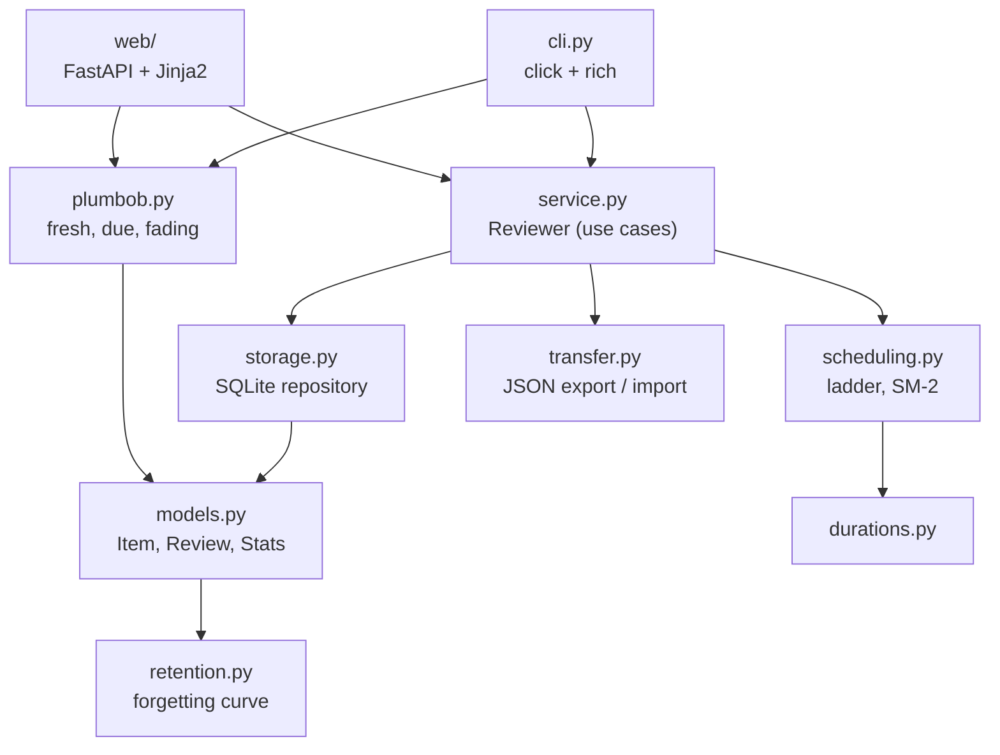

# Architecture

Ebbinghaus Reviewer is a small layered application. The scheduling rules are
pure, the persistence is a plain SQLite repository, and two thin delivery
layers - a command line and a local web app - share one application service.
Dependencies only point inward.

## Modules

| Module | Responsibility |
| --- | --- |
| [`scheduling.py`](../src/ebbinghaus_reviewer/scheduling.py) | `Grade`, `Strategy`, `Schedule`, and the `LadderScheduler` / `SM2Scheduler` strategies. Pure functions. |
| [`retention.py`](../src/ebbinghaus_reviewer/retention.py) | The exponential forgetting-curve estimate used for display. |
| [`plumbob.py`](../src/ebbinghaus_reviewer/plumbob.py) | The Sims-style plumbob: whether an item is fresh, due or fading. Pure. |
| [`models.py`](../src/ebbinghaus_reviewer/models.py) | Immutable records: `Item`, `Review`, `Stats`, `AgendaDay`. |
| [`storage.py`](../src/ebbinghaus_reviewer/storage.py) | `Repository`: one SQLite connection, versioned schema, explicit transactions. |
| [`service.py`](../src/ebbinghaus_reviewer/service.py) | `Reviewer`: add, grade, restart, edit, delete, due, agenda, stats, import/export. Owns the clock and the time zone. |
| [`transfer.py`](../src/ebbinghaus_reviewer/transfer.py) | Versioned JSON export format and strict validation on import. |
| [`presentation.py`](../src/ebbinghaus_reviewer/presentation.py) | Labels shared by the CLI and the web app ("due in 2 days", "ladder · step 2 of 4"). |
| [`cli.py`](../src/ebbinghaus_reviewer/cli.py) | The `ebbinghaus` command. |
| [`web/`](../src/ebbinghaus_reviewer/web/) | Server-rendered pages; works without JavaScript. Optional (`[web]` extra). |
| [`demo.py`](../src/ebbinghaus_reviewer/demo.py) | Sample collection, generated by replaying reviews through the real service. |

## Data model

Two tables, created by migration 1 in `storage.py`:

**`items`** - one row per thing you studied.

| Column | Notes |
| --- | --- |
| `id` | primary key |
| `title`, `notes`, `subject` | text; the title may not be blank (CHECK constraint) |
| `strategy` | `ladder` or `sm2` |
| `step` | ladder rung being waited on, or the SM-2 repetition count |
| `ease` | SM-2 ease factor |
| `interval_seconds` | gap between the last study/review and `due_at` |
| `due_at` | next review; `NULL` once a ladder item is mastered |
| `studied_at`, `last_reviewed_at`, `created_at`, `updated_at` | timestamps |

**`reviews`** - the review log (deleted together with its item).

| Column | Notes |
| --- | --- |
| `item_id` | foreign key, `ON DELETE CASCADE` |
| `reviewed_at`, `grade` | when, and how well |
| `scheduled_for` | the due time this review answered (lets you see early/late reviews) |
| `interval_seconds` | the interval chosen for the next review |

Review and lapse counts are computed from the log rather than stored, so they
can never drift.

### Schema versions

The schema version is kept in SQLite's `PRAGMA user_version`. Opening a
database applies any missing migrations inside a transaction; a database from a
*newer* release, or a file that is not an Ebbinghaus Reviewer database, is
refused with a clear error instead of being modified.

## Time

* All timestamps are timezone-aware. They are stored in UTC as ISO-8601 text
  with second precision, which also sorts correctly as text.
* "Now" comes from an injectable clock and "today" from an injectable time
  zone (default: the system's). The day boundary is local midnight, so the
  agenda and the statistics match the user's calendar.
* Tests pin both with a fixed-offset zone (UTC+9) and a manual clock, which
  makes date arithmetic fully deterministic.

## Where the data lives

`$EBBINGHAUS_DB` if set, otherwise the platform's per-user data directory
(via [platformdirs](https://pypi.org/project/platformdirs/)):

| Platform | Default path |
| --- | --- |
| Linux | `~/.local/share/ebbinghaus-reviewer/ebbinghaus.sqlite3` |
| macOS | `~/Library/Application Support/ebbinghaus-reviewer/ebbinghaus.sqlite3` |
| Windows | `%LOCALAPPDATA%\ebbinghaus-reviewer\ebbinghaus.sqlite3` |

The CLI and the web app open the same file, so you can log an item in the
terminal and review it in the browser.

## Web app

* Every page is server-rendered HTML; actions are plain forms using the
  POST/redirect/GET pattern, and only local redirect targets are accepted.
* Styles and the icon are bundled - no CDN, no build step.
* It is a single-user tool: it binds to `127.0.0.1` by default and has no
  accounts. Do not expose it on a network you do not trust.

## Testing

`pytest` covers every layer: property-based tests (Hypothesis) for scheduler
invariants, repository tests on in-memory and file databases, service tests
with a manual clock, the CLI through Click's `CliRunner`, and the web app
through FastAPI's `TestClient`. CI runs lint (ruff), strict type checking
(mypy) and the tests on Python 3.10 through 3.14, and smoke-tests the built
wheel.
